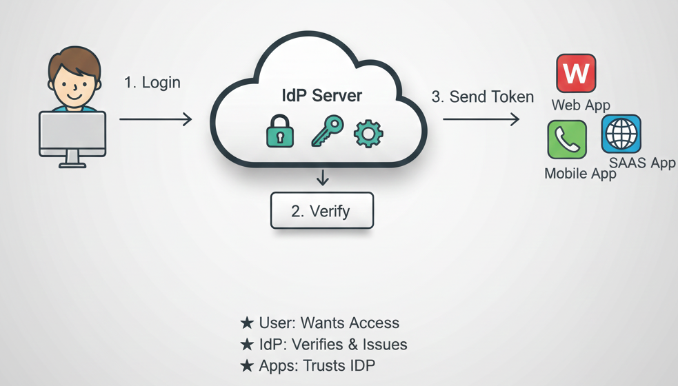

# Bootstrap IdP Server

Self-host your own Identity Provider (IdP) server using open-source solutions. This repository provides automated infrastructure and configuration scripts to deploy a production-ready authentication server.

  

## Available IdP Solutions

### Authentik
Authentik is an open-source identity provider focused on flexibility and versatility. [Full setup guide](./authentik-setup.md)