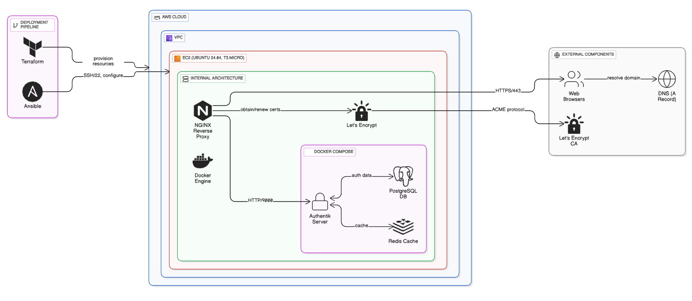

# Authentik Setup Guide

Authentik is an open-source Identity Provider that supports SAML, OAuth2, LDAP, and more.

## Prerequisites

- AWS account
- Domain name with DNS access
- SSH key pair for EC2 access
- Terraform and Ansible installed

<p align="center">  </p>

## Step 1: Configure Terraform Variables

Edit `idp-ec2-server/terraform/terraform.tfvars`:

```hcl
aws_region    = "eu-north-1"
aws_profile   = "your-aws-profile"  # optional
key_pair_name = "your-key-pair"
server_name   = "idp-server"
```

## Step 2: Deploy EC2 Instance

```bash
cd idp-ec2-server/terraform
terraform init
terraform apply
```

Note the public IP address from the output.

## Step 3: Configure DNS

Point your domain to the EC2 instance public IP:
```
A Record: authentik.yourdomain.com -> <EC2_PUBLIC_IP>
```

## Step 4: Update Ansible Inventory

Edit `idp-ec2-server/ansible/inventory`:

```ini
[app-server]
server ansible_host=<EC2_PUBLIC_IP> ansible_user=ubuntu ansible_ssh_private_key_file=~/.ssh/your-key.pem
```

## Step 5: Configure Authentik Environment

Edit `authentik/.env` and set:
- `AUTHENTIK_SECRET_KEY` - Generate a secure random key
- `AUTHENTIK_POSTGRESQL__PASSWORD` - Database password
- Domain and email settings

## Step 6: Update Domain in Playbook

Edit `idp-ec2-server/ansible/playbook.yaml` and update the domain:

```yaml
vars:
  domains:
    - { server_name: "authentik.yourdomain.com", port: 9000 }
```

## Step 7: Run Ansible Playbook

```bash
cd idp-ec2-server/ansible
ansible-playbook -i inventory playbook.yaml
```

This will:
1. Install Docker and Docker Compose
2. Deploy Authentik containers
3. Configure NGINX reverse proxy
4. Obtain SSL certificate from Let's Encrypt

## Step 8: Access Authentik

Visit `https://authentik.yourdomain.com` and complete the initial setup:
- Default credentials are in the Authentik documentation
- Change the admin password immediately
- Configure your authentication flows

## Troubleshooting

**Connection refused:**
- Check security group allows ports 22, 80, 443
- Verify EC2 instance is running

**SSL certificate fails:**
- Ensure DNS is properly configured
- Domain must be publicly accessible
- Check Let's Encrypt rate limits

**Docker containers not starting:**
- SSH into server: `ssh -i ~/.ssh/your-key.pem ubuntu@<EC2_IP>`
- Check logs: `cd /home/ubuntu/idp-server && docker compose logs`
